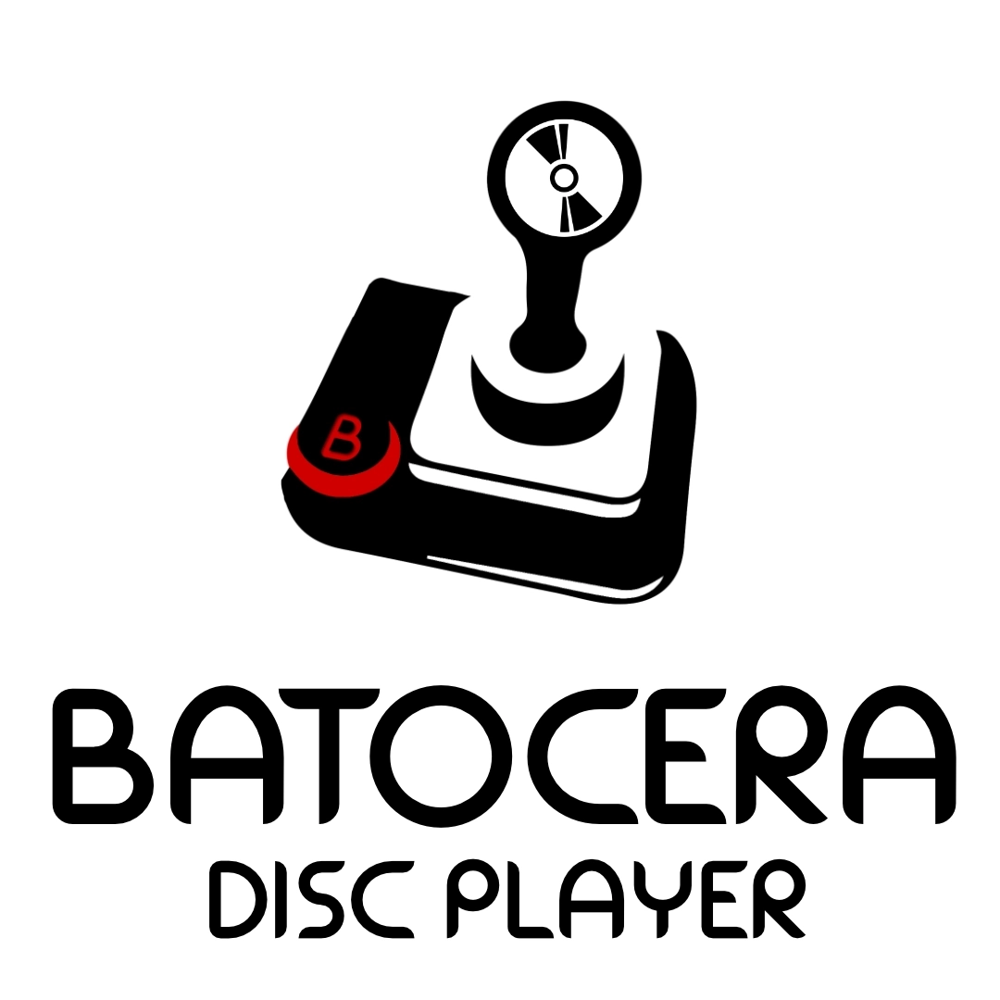
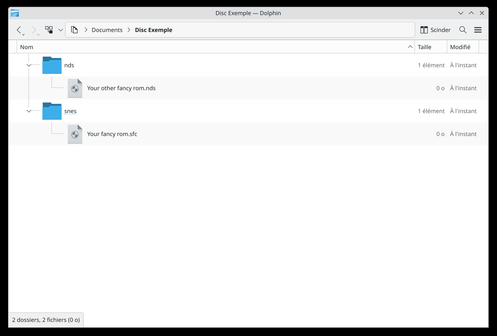

# **WIP, this is not finished and should not be followed yet!**

# <center>Batocera Disk Player</center>


Batocera Disk Player is an addon for Batocera that lets you read ROMs directly from a disc (CD, DVD, or Blu-ray depending on what your drive supports).
Burn your disc, and read it on your favorite emulation system! 

## 💾 Installation
Copy these three commands in the terminal (xTerm by default):  
```
wget batodisc.xyz/get.sh  
chmod +x get.sh
bash get.sh
```
OR, in one command:
```
wget batodisc.xyz/get.sh && chmod +x get.sh && bash get.sh
```
## 💿 How to use it?
Just follow the installation steps, burn your disc, and insert it into a disc drive connected to your Batocera system (internal or external)!

## 📀 How do I make my own discs?
That's pretty simple. You have to burn your ROMs to your disc using regular burning software (Windows Explorer works fine, or [K3b](https://apps.kde.org/fr/k3b/) on Linux) using **a specific folder structure**.  
The ROMs should be placed in a sub-folder with the same name that Batocera uses for their ROM folders.  

For example:  
Super NES ROMs: *snes*  
Nintendo DS: *nds* 
<p align="center"></p>

## 🧐 Why?
All video game consoles have their own respective physical games *(even if, sadly, this tends to disappear)*.  
BUT, that's not the case for Batocera! That's why I decided to change this.

## 👀 Credits
This project has been inspired by the amazing [BUA](https://github.com/batocera-unofficial-addons/batocera-unofficial-addons).

## ⚠️ DISCLAIMER
This addon will **NOT make you able to read original game discs**! This is meant to be used with discs that are burned specifically for this purpose.  
The author(s) of the addon are not responsible for anything going wrong on your machine *(although no issues are expected to occur)*.  
Also, this addon is completely **unaffiliated with Batocera or BUA**.
